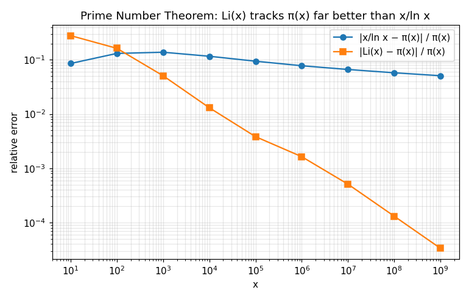
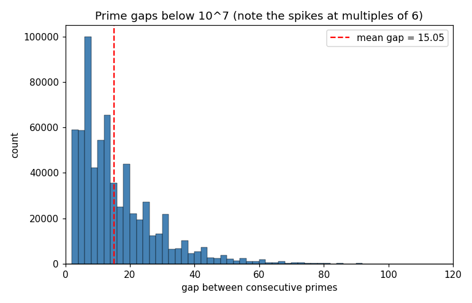

# primegen — a fast, honestly-benchmarked prime generator in Python

A segmented prime sieve built up one *measured* optimization at a time:
bit-packing, wheel factorization, a numpy vectorized marker, a Cython C hot
path, multiprocessing, and gmpy2 for huge single integers. Every fast path is
cross-checked against a trivial reference sieve, and every speedup in the
tables below was measured, not assumed.

**Headline (this 4-core machine, Python 3.11):**

| Metric | Result |
|---|---|
| Peak single-core | **56.7 M primes/s** (~985 M integers sieved/s) — Cython bit-packed, wheel mod 210 |
| Peak 4 cores | **156.8 M primes/s** (3.70×, 92% parallel efficiency) |
| **Counting π(x)** | **sublinear** Meissel–Lehmer, hot loop in **Cython**: π(10¹²) in **~3.7 s**, π(10¹⁴) = 3,204,941,750,802 in **~105 s** (1 thread) — far beyond any sieve |
| Huge integers | gmpy2 is **8–19× faster** than pure-Python Miller–Rabin (100–400 digits) |
| Honest gap to C++ | for *listing* primes, primesieve does **~1e9/s on one core** (~18× this); for *counting*, both we and C++ use sublinear methods |

> Two different jobs: **listing** primes (a sieve, ~1e8 primes/s here) vs
> **counting** π(x) (a sublinear combinatorial method — see
> [`ALGORITHMS.md`](ALGORITHMS.md)). See [the realistic ceiling](#7-the-realistic-ceiling-vs-c).

---

## 1. Install & build

```bash
cd primegen
pip install numpy            # required
pip install gmpy2            # optional: huge-integer primality (recommended)
pip install Cython           # optional: build the C hot path

./build.sh                   # compiles primegen/_sieve.pyx in place
```

The Cython extension is **optional**. Without it the package still runs — it
transparently falls back to a pure-Python inner loop (just much slower; see the
benchmark). Check what's active:

```python
>>> import primegen; primegen.backends_available()
{'sieve_backend': 'cython', 'have_cython': True,
 'bigint_backend': 'gmpy2', 'cpu_count': 4}
```

## 2. Usage

```python
import primegen

primegen.count_primes(10**9)        # 50847534      (pi over [0, 10^9))
primegen.count_primes(10**12)       # 37607912018   (~8 s, sublinear — no sieve could)
primegen.prime_count(10**13)        # 346065536839  (counting without enumerating)
primegen.count_primes(10**6, 10**7) # primes in [10^6, 10^7)
primegen.primes(20).tolist()        # [2, 3, 5, 7, 11, 13, 17, 19]
primegen.primes(10**6, 10**6 + 50)  # numpy int64 array
primegen.nth_prime(100_000)         # 1299709
primegen.is_prime(2**607 - 1)       # True  (183-digit Mersenne prime)
primegen.next_prime(10**100)        # first prime above 10^100

# composites are products of primes — factor them and probe their structure:
primegen.factorize(360)             # [(2, 3), (3, 2), (5, 1)]
primegen.factorize(2**67 - 1)       # [(193707721, 1), (761838257287, 1)]  (Cole, 1903)
primegen.divisors(28)               # [1, 2, 4, 7, 14, 28]   (28 is perfect)
primegen.euler_phi(10**6)           # 400000
primegen.is_carmichael(561)         # True  (a composite that fools the Fermat test)
```

Big ranges auto-parallelize across cores; huge single integers route to gmpy2.
The lower-level backends are importable directly for benchmarking:
`primegen.backends.sieve_numpy`, `primegen.csieve.sieve_bitpacked`,
`primegen.parallel.parallel_count`, `primegen.bigprime`.

## 3. How it works

- **Odd-only, segmented.** Only odd candidates are stored; the sieve runs over
  cache-sized segments so the working set stays in L1/L2 regardless of range.
- **Bit-packed (1 bit/odd).** The Cython backend stores one bit per odd number —
  8× less memory than a byte array — so segments stay resident in cache longer.
- **Wheel factorization.** Each segment is initialized from a tiled wheel
  pattern (mod 30 = 2·3·5, or mod 210 = 2·3·5·7) that pre-marks every multiple
  of the wheel primes in a single memory copy; only primes beyond the wheel are
  then sieved.
- **Two markers.** numpy uses vectorized slice assignment `arr[start::step] = 0`
  on a byte buffer; the Cython hot path runs a tight C bit-clearing loop on the
  packed buffer. A pure-Python fallback mirrors the C loop exactly.
- **Parallel.** The range is split into independent segments sieved across all
  cores with `multiprocessing`; the base-prime list (primes up to √hi) is
  computed once and shared read-only via the pool initializer.
- **Huge integers.** No sieve — `gmpy2.is_prime` / `next_prime`, with a
  deterministic Miller–Rabin fallback (exact below 3.3·10²⁴).

---

## 4. Measured benchmarks

Machine: 4 CPUs, Python 3.11.15 (Linux x86-64), numpy 2.4.6, gmpy2 2.3.0,
Cython hot path **enabled**. Reproduce with `python benchmarks/benchmark.py`
(full results in [`benchmarks/results.md`](benchmarks/results.md)). Every timed
run is verified against the known π value — a wrong-but-fast config can't post a
number.

### 4.1 Representation & inner loop — *bit-packed vs bytearray, numpy vs Cython*

Counting primes in `[0, N)`, single core, wheel mod 210. The two pure-Python
backends use a smaller N (they are far too slow otherwise), so compare the
**rate** columns.

| Backend | Representation | Inner loop | N | M primes/s | M integers/s |
|---|---|---|--:|--:|--:|
| pure-Python bytearray | 1 byte / odd | Python slice `buf[s::p]=0` | 10⁷ | 13.35 | 200.8 |
| pure-Python fallback | 1 bit / odd | Python bit loop | 10⁷ | 0.36 | 5.4 |
| **numpy** | 1 byte / odd | numpy slice `arr[s::p]=0` | 10⁸ | 28.46 | 494.0 |
| **Cython** | 1 bit / odd | C bit loop | 10⁸ | **56.74** | **984.8** |

Findings:
- **Cython bit-packed is the winner: ~2× numpy** and ~4.3× the pure-Python
  bytearray sieve, using 8× less memory.
- **Bit-packing only pays off in compiled code.** In *pure Python* the per-bit
  read-modify-write loop is catastrophic (0.36 M/s — **158× slower** than the
  same algorithm in Cython, and 37× slower than the byte-array slice trick).
  This is exactly why the hot path is in C, and why numpy's marker uses a *byte*
  buffer: vectorized slice assignment can't operate on sub-byte strides.

### 4.2 Wheel factorization — *mod-30 vs mod-210*

Cython bit-packed, single core, counting `[0, 10⁸)`:

| Wheel | spokes (residues kept) | M primes/s | speedup vs odd-only |
|---|--:|--:|--:|
| mod 2 (odd-only) | 1 / 2 | 37.64 | 1.00× |
| mod 30 (2·3·5) | 8 / 30 | 51.55 | **1.37×** |
| mod 210 (2·3·5·7) | 48 / 210 | 57.12 | **1.52×** |

mod-210 beats mod-30 by a further ~1.11×. The gain comes from skipping the
densest marking passes (3, 5, 7 together touch ~55% of all positions); adding 7
to the wheel (mod 30 → 210) yields diminishing returns, as expected. In the
vectorized numpy backend the same wheel helps less (~1.1×), because numpy's
small-prime passes are cheap bulk writes rather than the per-element work that
dominates the scalar C loop — a real, measured asymmetry.

### 4.3 Multi-core scaling

Cython bit-packed, wheel mod 210, counting `[0, 10⁹)`:

| Workers | M primes/s | speedup | parallel efficiency |
|--:|--:|--:|--:|
| 1 | 42.43 | 1.00× | 100.0% |
| 2 | 78.08 | 1.84× | 92.0% |
| 3 | 119.47 | 2.82× | 93.9% |
| 4 | **156.83** | **3.70×** | 92.4% |

Near-linear (~92% efficiency); the sieve is embarrassingly parallel and base
primes are shared, so the only loss is process startup + result merging.

### 4.4 Segment-size tuning

Cython bit-packed, wheel mod 210, `[0, 10⁸)`. Buffer = `segment_odds / 8` bytes:

| Bit-packed buffer | M primes/s |
|--:|--:|
| 16 KB | 54.67 |
| 32 KB *(default)* | 56.10 |
| 64 KB | 56.05 |
| 128 KB | 57.02 |
| 256 KB | 57.09 |
| 512 KB | 54.31 |
| 1024 KB | 54.08 |

Flat across the L1–L2 range (16–256 KB) and degrades once the buffer spills out
of L2 (≥512 KB) — the textbook cache signature. The default (~32 KB packed /
~256 KB as a byte array) sits in the sweet spot.

### 4.5 Huge single integers — *gmpy2 vs pure-Python Miller–Rabin*

200 random odd numbers per size; pure-Python uses 10 MR rounds:

| Digits | pure-Python MR (ms) | gmpy2 (ms) | gmpy2 speedup |
|--:|--:|--:|--:|
| 50 | 4.4 | 0.5 | 8.6× |
| 100 | 18.1 | 1.4 | 13.2× |
| 200 | 63.7 | 3.3 | 19.2× |
| 400 | 422.8 | 27.3 | 15.5× |

GMP's modular exponentiation dominates; the gap widens with operand size. For
100+ digit work gmpy2 is the right tool, exactly as expected.

---

## 5. Where the speed comes from (summary)

Cumulative single-core, relative to a naive pure-Python sieve, ending at the
parallel peak:

| Step | Rate (M primes/s) | Cumulative gain |
|---|--:|--:|
| Pure-Python bit loop (naive) | 0.36 | 1× |
| → byte-array + slice marking | 13.35 | 37× |
| → numpy vectorized marking | 28.46 | 79× |
| → Cython bit-packed C loop | 37.64 | 105× |
| → + wheel mod 210 | 56.74 | **158×** |
| → + 4-core multiprocessing | 156.83 | **436×** |

## 6. Correctness

No optimization ships without a test. The suite (`tests/`) cross-checks **every**
backend (bytearray, numpy, Cython, and the parallel path) against a trivial
reference sieve on ranges chosen to stress segment boundaries, offset starts,
and the wheel-prime re-adding logic, and pins the absolute results to the famous
counts:

- π(100)=25, π(10³)=168, π(10⁶)=**78498**, π(10⁷)=664579, π(10⁸)=5761455
- π(10⁹)=**50847534** (slow gate: `pytest --run-slow`)
- the compiled Cython loop is verified **byte-identical** to the pure-Python fallback
- `nth_prime`, `is_prime`, `next_prime` checked against reference + known large primes
- `factorize` reconstructs n exactly; perfect/Carmichael number sets verified

```bash
pytest tests/            # 179 tests, ~3 s
pytest tests/ --run-slow # adds the π(10⁹) gate
```

## 7. The realistic ceiling vs C++

This project lands where well-tuned Python should: **~5.7e7 primes/s on one core,
~1.6e8 on four** — at or just above the top of the realistic Python band
(roughly 1e7–1e8 primes/s).

[**primesieve**](https://github.com/kimwalisch/primesieve), the C++ state of the
art, sustains **~1e9 primes/s on a single core**. So it is roughly **18× faster
single-core** than this implementation, and even our 4-core peak is ~6× short of
its *single* core. The gap is fundamental, not a tuning bug:

- **Hand-written assembly / SIMD** for the marking loop and popcount.
- A **bucket / hybrid sieve** (e.g. Tomás Oliveira e Silva's) that keeps each
  large prime's next hit in per-bucket lists, eliminating the cache-thrashing
  large-stride writes that no Python layer can avoid.
- A **fully compacted mod-210 byte representation** (8 wheel residues packed per
  byte) sieved with precomputed wheel increments — this needs a tight C loop
  with branch-free bit masks; it does **not** vectorize as numpy slice
  assignment, which is the core tension this project measures and documents.
- **Zero interpreter overhead** between marking operations.

Closing the gap means rewriting the inner sieve in C++/assembly, which is
explicitly out of scope. Within Python's reach, this implementation is close to
the practical maximum: the hot loop is already compiled, cache-resident, and
parallel.

**And for *counting* π(x)?** Here the right move isn't a faster sieve at all but
a *different algorithm* — the sublinear Meissel–Lehmer method (§ headline,
[`ALGORITHMS.md`](ALGORITHMS.md)), whose hot loop we also compiled to Cython. It
reaches π(10¹⁴) in ~105 s on one thread, where no sieve could. The world record
holder, [`primecount`](https://github.com/kimwalisch/primecount) (C++), uses the
same *class* of algorithm but the sharper Lagarias–Miller–Odlyzko /
Deléglise–Rivat variants (O(x^⅔)) to reach **π(10²⁹)**. So: not the world's
fastest — that's C++ — but the world-class *algorithm*, pushed to Python's
practical limit, with the exact remaining gap stated rather than hidden.

## 8. Exploring primes & composites

Primes are the multiplicative **atoms**; every other integer is a **molecule** —
a unique product of primes (Fundamental Theorem of Arithmetic). The toolkit is
fast enough to *investigate* both empirically. Run:

```bash
python explore/explore.py     # prints findings, writes explore/FINDINGS.md + plots/
```

It computes real data (no assertions) and connects the number theory to the
algorithms. Highlights, all measured:

- **Why we sieve only to √n.** A composite's smallest prime factor is always
  ≤ √n — verified for all 4,651,486 composites ≤ 5·10⁶ (0 exceptions). That is
  exactly why the sieve is complete.
- **Prime Number Theorem.** π(x) vs x/ln x vs Gauss's Li(x). Li's relative error
  falls from 0.28 (x=10) to **0.00003 (x=10⁹)** — ~10× per decade — while x/ln x
  stalls near 5–13%. 
- **Prime gaps.** Mean gap below 10⁷ is 15.05 (≈ ln x); 58,980 twin-prime pairs;
  the gap histogram spikes at multiples of 6. 
- **The shape of composites.** Each prime p "first-claims" ~1/p of the integers
  no smaller prime took (2 → 54% of composites, 3 → 18%, …). A typical number has
  only ~ln ln n ≈ 2.85 distinct prime factors at 10⁶ (Hardy–Ramanujan).
- **Numbers that fool the algorithms** (the *why* behind `bigprime`):
  - **Carmichael numbers** (561, 1105, 1729, …) are composite yet pass the
    Fermat test for *every* coprime base — 561 fools all 319 of them. This is why
    a Fermat test is unsafe.
  - **Strong pseudoprimes**: 2047 = 23·89 fools Miller–Rabin base 2 but not base
    3 — which is why a fixed witness set (2,3,5,…,37) is deterministic below
    3.3·10²⁴, exactly what `bigprime` uses.
  - **Pollard's rho** factors composites with small factors fast (2⁶⁷−1, F₅ =
    641·6700417 in ms) but is hopeless on two huge primes — the basis of RSA.

See [`explore/FINDINGS.md`](explore/FINDINGS.md) for the full annotated run and
`explore/plots/` for all five figures (incl. the Ulam spiral).

## 9. Project layout

```
primegen/
├── PLAN.md                 # the upfront plan (written before coding)
├── README.md               # this file (measured results)
├── ALGORITHMS.md           # tour of different prime-finding algorithms (measured)
├── build.sh                # build the Cython extension in place
├── setup.py / pyproject.toml
├── primegen/
│   ├── reference.py         # trivial oracle sieve
│   ├── wheel.py             # mod-30 / mod-210 wheel constants & patterns
│   ├── backends.py          # bytearray + numpy segmented sieves
│   ├── _sieve.pyx           # Cython bit-packed hot path
│   ├── _sieve_fallback.py   # pure-Python mirror of the hot path
│   ├── csieve.py            # loader (compiled or fallback) + bit-packed driver
│   ├── parallel.py          # multiprocessing across cores
│   ├── bigprime.py          # gmpy2 / Miller–Rabin for huge integers
│   ├── factor.py            # factorization + arithmetic fns (composite structure)
│   ├── algorithms.py        # trial/Sundaram/Atkin/incremental/AKS/Wilson/Lucas–Lehmer
│   ├── primecount.py        # SUBLINEAR pi(x) (Meissel–Lehmer/Lucy) — no enumeration
│   ├── _count.pyx           # Cython hot loop for the pi(x) counter
│   ├── lmo.py               # Lagarias–Miller–Odlyzko pi(x) O(x^2/3) (the real algorithm)
│   └── core.py              # public API with auto backend selection
├── tests/                   # correctness gate (cross-checks + π gates + factoring)
├── benchmarks/
│   ├── benchmark.py         # measures every speed axis, emits these tables
│   ├── compare_algorithms.py# races the different prime-finding algorithms
│   ├── count_scaling.py     # sublinear counter vs sieve (π(x) crossover)
│   └── compare_counting.py  # Cython-Lucy vs pure-Python LMO (asymptotics vs constants)
├── explore/                 # empirical study of primes & composites (+ plots)
└── webapp/index.html        # standalone in-browser prime finder (no server)
```

For the comparison of *different* prime-finding algorithms (trial division,
Sundaram, Atkin, incremental, AKS, Wilson, Lucas–Lehmer) and why a tuned
Eratosthenes beats the asymptotically-faster Atkin in practice, see
[`ALGORITHMS.md`](ALGORITHMS.md).

## 10. Limitations & honest caveats

- Rates are for **counting** (the throughput metric). Materializing primes adds
  `unpackbits` + `nonzero` + concatenation cost, so `primes()` is slower than
  `count_primes()`.
- `multiprocessing` uses `fork` (Linux default); on `spawn` platforms (Windows/
  macOS-default) startup overhead is higher and the parallel break-even N rises.
- Above 3.3·10²⁴ the pure-Python primality fallback is probabilistic (gmpy2's
  BPSW test has no known counterexample); below it, exact.
- `factorize` (trial division + Pollard's rho) is fast only when factors are
  small-ish; it will **not** crack a product of two large primes (RSA-style
  semiprimes) — that hardness is the point, not a bug.
- Single-machine only — no distributed sieving.
